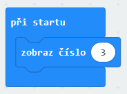
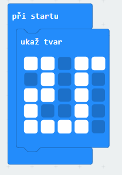
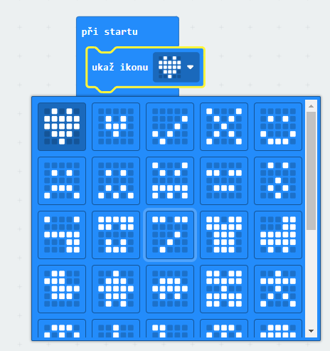
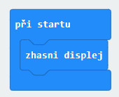
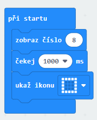
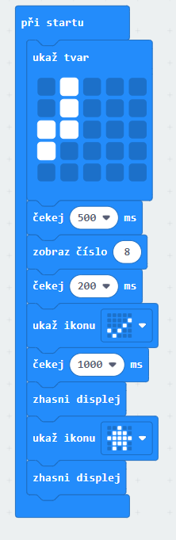

# Zobrazování a rozsvicování diod

Rozsvicovat diody Microbitu můžeme hned několika způsoby

# 1. Funkce zobraz číslo 

# 2. Funkce ukaž tvar

# 3. Funkce ukaž ikonu

# 4. Funkce zobraz text

# 5. Funkce ukaž šipku

Diody také ale potřebujeme zhasínat, k tomu slouží funkce 
# Zhasni displej

Mezi jednotlivými zobrazovacími funkcemi také ale občas potřebujeme i počkat. K tomu slouží

# Funkce čekej

# Funkce můžeme různě kombinovat a vytvářet tak řetězce

