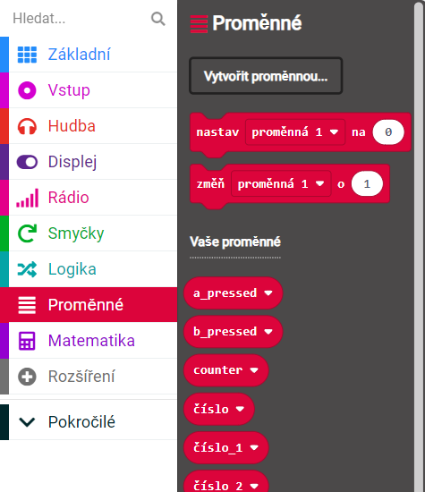

# Co je to proměnná?
Je to místo v paměti, kam můžeme ukládat různé hodnoty, které se mohou časem měnit, proto je nazýváme proměnné. </b>

# K čemu nám proměnná slouží?
Do proměnné můžeme ukládat různé datové typy jako například:
* Text (string)
* Číslo (intieger)
* Pravda nebo nepravda (Boolean)

# Proměnné v blocích vypadají takto:

Máme tu ukázané dvě možnosti, jak můžeme s proměnnými manipulovat.
1. <b>Nastavit</b> proměnnou na určitou hodnotu
2. <b>Přičíst</b> k proměnné určitou hodnotu

# Proč ale proměnné používat?
Při tvorbě delšího kódu, kde provádíme desítky, stovky nebo i více početních perací je snažší používat názvy, které se nám dobře pamatují a podle kterých se lépe orientuje. 
Uvedeme si na příkladu:
<h2> Představte si, že máte hru s autem </h3>   
Vaše auto jezdí dlouhé trasy a na každé benzince po cestě zastaví, aby natankovalo.
 
Vytvoříte si proměnnou s názvem:
<h3>Zbývající km</h3>
S touhle proměnnou můžete manipulovat tak, že po každém ujetém kilometru odečtete <b>-1 km,</b> a vždy při natankování naopak přičtete určitý počet kilometrů. 
 

# Další ukázky využití proměnných:

<h1>Úkol</h1>
Zkuste si na váš microbit vytvořit a nahrát program, který bude fungovat následovně:
 
 

1. Při zmáčknutí tlačítka <b>A</b> auto spálí palivo na <b>2</b> kilometry cesty
2. Při zmáčknutí tlačítka <b>B</b> auto natankuje palivo na dalších <b>5</b> kilometrů cesty
3. Pomocí stlačení obou tlačítek <b>A + B</b> se vypíše aktuální počet zbývajících kilometrů

    ...časem si tento program budeme s nasbíranými znalostmi moci vylepšovat.

 
 