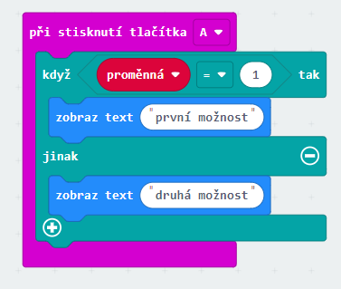
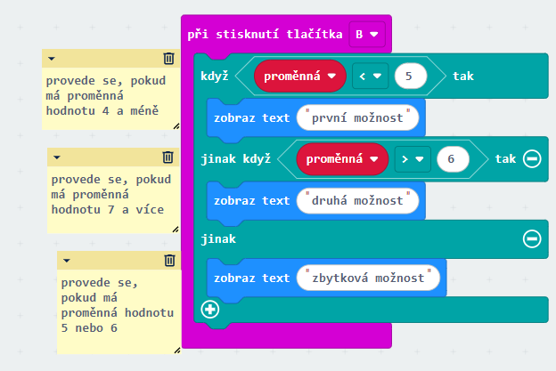
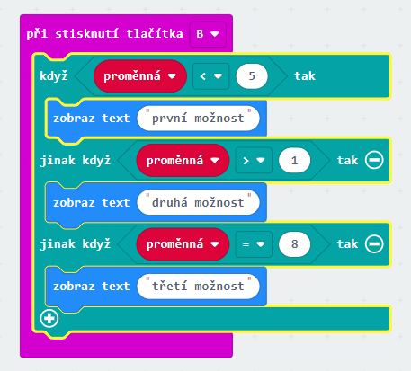

# Podmínky

Podmínky nám slouží k tomu, aby se program mohl sám rozhodovat.

Rozhodování funguje na základě větví a program si vždy vybere, kterou větev použije. 
Každá větev má podmínku, která se musí splnit, aby se provedly následující akce v dané větvi.

Podmínka o dvou základních větvích vypadá takhle:

Podmínka o více větvích vypadá takhle:

Může existovat i podmínka bež zbytkové větve.

 