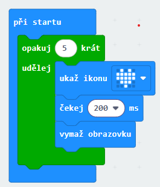
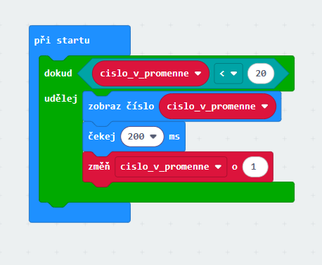

# Cykly (smyčky)

Smyčky slouží k opakování kódu, který je ve smyčce 

### Co tento kód dělá?
5x zopakuje (ukáže srdce, počká 200ms, vymaže obrazovku)

Podobně fungují všechny ostatní smyčky

## Smyčka s podmínkou dokud (while)

Provádí kód, dokud platí podmínka v hlavičce podmínky.

Tady je to ukázáno na jednoduchém počítadle.
Počítadlo napočítá do 19-ti.

